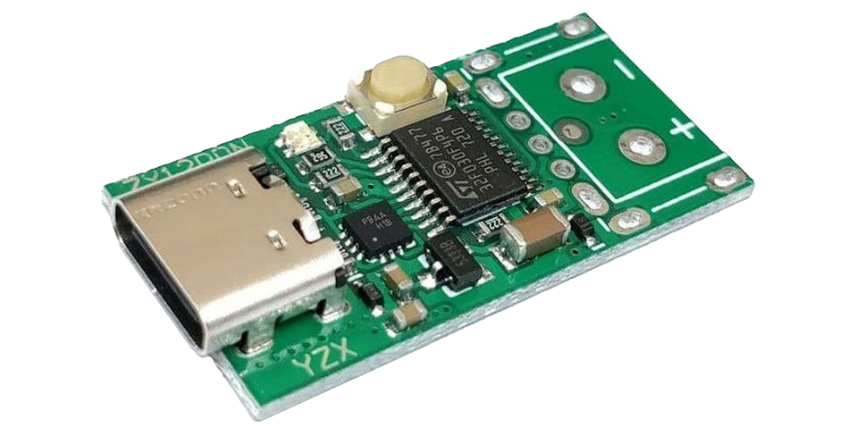
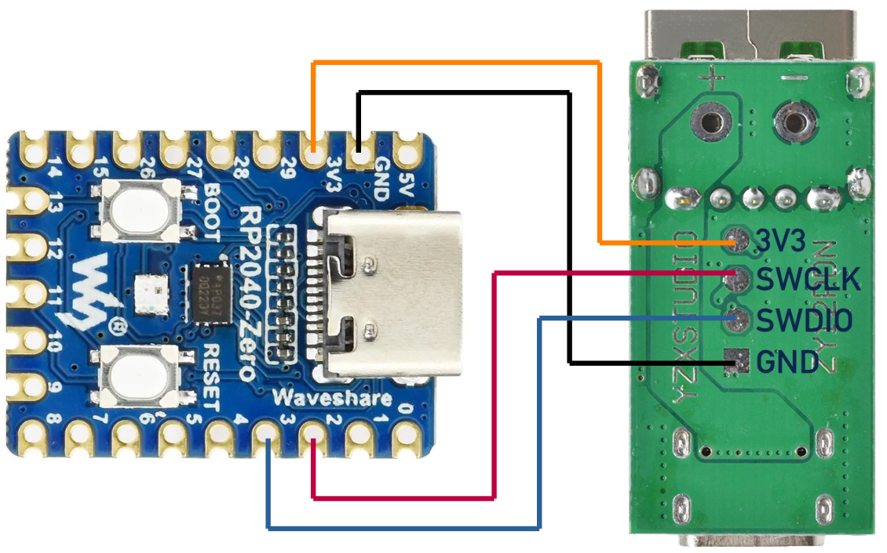

# ThinkPad USB-C Power Button

Firmware I use to turn a **ZY12PDN USB-PD trigger board** into an external
power button for my ThinkPad motherboard. It uses Lenovo's USB-C dock-button
messages to request startup while the laptop is off and receiving standby
power. The accessory has a physical button and also sends startup pulses
automatically when connected.

**This is an "it works for me" project.** I'm sharing the code and the notes
that got my setup working. It is a small, blocking implementation built for
that setup, not a general-purpose USB-PD stack or a promise of compatibility
with every ThinkPad. You may need to adapt the timing or code for yours.

My setup is an **NM-F261 motherboard from the ThinkPad P14s Gen 4 / T14 Gen 4
AMD family**, with a charger on one USB-C port and this accessory on the
other. The main laptop battery is absent; the RTC battery is connected.
The physical button has repeatedly started the board, and the automatic
sequence has also booted it. Cold-attach timing has been sensitive during
development; I have not established reliability across other boards,
firmware versions or repeated cold power cycles.

[Download](#download) · [Hardware](#hardware) · [Build](#build) · [Backup](#back-up-the-factory-firmware) ·
[Flash](#flash-the-accessory) · [Protocol notes](docs/protocol.md)

## Download

The [releases page](https://github.com/MartinezTorres/thinkpad_usb_power_button/releases)
has firmware bundles and SHA-256 checksums. Each bundle includes the ELF
and binary, programmer configuration, matching project and libopencm3
sources, and license notices. These are "it works for me" snapshots.

Download the named `thinkpad-usb-power-button-<version>.tar.gz` asset for
prebuilt firmware; GitHub's automatic "Source code" archives contain the
project source only. Back up your accessory before flashing. From inside
an extracted firmware bundle, use:

```sh
sha256sum -c FIRMWARE-SHA256SUMS
openocd -f openocd-picoprobe.cfg -c "program firmware.elf verify reset exit"
```

## What it does

- Negotiates a 5 V USB-PD contract and enters Lenovo's vendor mode.
- Sends two automatic power-button pulses after the initial handshake.
- Sends another pulse whenever the accessory's physical button is pressed.
- Uses the onboard RGB LED for progress and failure indications.

The application is contained in [one C++ file](src/main.cpp). It runs on the
accessory; setup requires no laptop OS driver or BIOS/EC flashing step.

## Hardware

| Component | Requirement |
| --- | --- |
| ZY12PDN board | STM32F030F4 MCU and FUSB302B USB-PD controller |
| Programmer | Raspberry Pi Pico running CMSIS-DAP Debug Probe firmware |
| Laptop power | Separate charger providing standby power |
| Connections | USB-C cable for the accessory and three SWD wires for programming |

[](docs/board.png)

The accessory requests **5 V at 100 mA** from the laptop; it does not supply
power to the laptop. The ThinkPad must already have standby power and be
willing to power its accessory port. The programmer is only needed for
flashing.

Check the board's chip markings before flashing: products sold under the
same name may use different hardware. This firmware targets the
STM32F030F4 with 16 KiB flash and 4 KiB RAM. The upstream
[hardware analysis](https://github.com/manuelbl/zy12pdn-oss/wiki/Hardware-analysis)
has component and programming-pad illustrations.

Keep the ZY12PDN's output terminals unconnected: they are wired directly to
USB VBUS. The original voltage-selection function is replaced by this
firmware.

### Programmer wiring

Load the official `debugprobe_on_pico.uf2` onto an original RP2040 Pico's
BOOTSEL drive, following
[Raspberry Pi's Debug Probe instructions](https://www.raspberrypi.com/documentation/microcontrollers/debug-probe.html).
Use firmware appropriate to your programmer board. The SWD pins below are
the official Pico firmware's defaults; custom picoprobe builds may differ.

| Probe signal | ZY12PDN pad | Physical pin on an original Pico |
| --- | --- | --- |
| GP2 | SWCLK | 4 |
| GP3 | SWDIO | 5 |
| GND | GND | e.g. 3 |

The defaults are defined in the
[Debug Probe Pico configuration](https://github.com/raspberrypi/debugprobe/blob/debugprobe-v2.3.1/include/board_pico_config.h).
Use GPIO names to identify connections on other RP2040 boards; their
physical pin positions differ. NRST is not required by the supplied
OpenOCD configuration.

[](docs/picoprobe_debug.png)

The wiring image shows an **RP2040-Zero** and includes a 3.3 V supply lead.
With that arrangement, leave the ZY12PDN's USB-C connector unplugged during
programming. Alternatively, power the target through USB-C and connect only
SWCLK, SWDIO and GND, omitting the 3.3 V lead. Use one target power source
at a time, a common ground and 3.3 V SWD signals. Do not connect 5 V to a
target signal or its 3.3 V pad.

## Build

Install Git, Python 3 with virtual-environment support, and OpenOCD 0.12.0
or a compatible version with CMSIS-DAP and STM32F0 support. The commands
below use Linux/macOS paths.

```sh
git clone https://github.com/MartinezTorres/thinkpad_usb_power_button.git
cd thinkpad_usb_power_button
python3 -m venv .venv
.venv/bin/python -m pip install platformio==6.1.19
.venv/bin/pio run
```

PlatformIO downloads the versions pinned in [platformio.ini](platformio.ini):
ST STM32 19.0.0, GCC ARM 7.2.1, libopencm3 package 1.10000.260625, and SCons
package 4.40801.0. The
[PlatformIO installation documentation](https://docs.platformio.org/en/latest/core/installation/index.html)
describes other environments.

The outputs are `.pio/build/zy12pdn/firmware.elf` and
`.pio/build/zy12pdn/firmware.bin`. Prebuilt files are attached to GitHub
releases rather than committed to the repository.
The reference build uses 4,096 bytes of flash and 24 bytes of static RAM;
stack use is additional. Building requires no connected programmer or
target and does not flash anything.

## Back up the factory firmware

Before replacing the ZY12PDN's firmware, connect and power it as described
above. These commands halt and read the accessory MCU without programming
flash. Use a new backup directory so you do not overwrite an older backup:

```sh
mkdir backup
openocd -f openocd-picoprobe.cfg \
  -c "init; halt; flash probe 0; dump_image backup/factory-1.bin 0x08000000 0x4000; reset run; shutdown"
openocd -f openocd-picoprobe.cfg \
  -c "init; halt; flash probe 0; dump_image backup/factory-2.bin 0x08000000 0x4000; reset run; shutdown"
cmp backup/factory-1.bin backup/factory-2.bin
sha256sum backup/factory-1.bin backup/factory-2.bin
wc -c backup/factory-1.bin backup/factory-2.bin
```

Each file should contain 16,384 bytes and the hashes should match. Check
that OpenOCD identified the expected STM32 and 16 KiB flash. If reads are
protected, stop before trying an unlock: removing STM32 read protection
can erase the contents you are trying to save. See the
[OpenOCD flash documentation](https://openocd.org/doc/html/Flash-Commands.html)
for the `stm32f1x` driver used for this F0 target.

Keep your backups somewhere safe. They are ignored by Git and are not
included in this repository. These commands back up main flash, not the
MCU's option bytes or other non-flash state. The programming command below
does not request changes to option bytes.

## Flash the accessory

After making the backup and building, run from the repository directory:

```sh
openocd -f openocd-picoprobe.cfg \
  -c "program .pio/build/zy12pdn/firmware.elf verify reset exit"
```

This writes the **ZY12PDN's STM32**, not the Pico or the laptop. The ELF
contains its load address. Look for `Verified OK`. The configuration uses
CMSIS-DAP at 100 kHz; despite the filename, it does not use the old
proprietary picoprobe adapter protocol.

To restore your own original main-flash backup:

```sh
openocd -f openocd-picoprobe.cfg \
  -c "program backup/factory-1.bin verify reset exit 0x08000000"
```

## Use

Disconnect the programmer and its power lead, connect the laptop's normal
charger, let standby power settle, then plug the accessory into the other
USB-C port. Attaching the charger and accessory simultaneously has been
less reliable in my setup.

The current `main()` does the following:

1. Negotiate 5 V, answer Lenovo discovery, enter vendor mode, and answer the
   first status request.
2. Service incoming messages for 8 seconds.
3. Send a neutral event group, a combined press/release, then another neutral
   event group.
4. Service messages for another 4 seconds, then send a second combined
   press/release.
5. Show green and wait for physical button presses while continuing to
   service the PD link. Each press requests one combined pulse; releasing
   the physical button rearms the next press.

`try_send()` adds its own waits and exchanges with the laptop, so these
are not precise pulse times measured from plug-in. Holding the physical
button does not request a corresponding long press.

These are ordinary power-button events. Attaching or resetting the
accessory while the laptop is running can send another power-button event
to that running system; this is not an "ensure on" command.

### LED indications

The RGB LED is active low: PA5 is red, PA6 green, and PA7 blue. Startup and
event processing reuse solid colours as progress indicators. Green appears
both during negotiation and in the button loop, so a green LED alone does
not confirm that the laptop booted.

| Repeating pattern | Meaning in the current source |
| --- | --- |
| Red/off, 500 ms each | FUSB302 I2C transaction received a NACK |
| Purple/off, 500 ms each | Received PD packet failed the software CRC check |
| Yellow 1 s / red 3 s | Pending event was not sent in a status reply before the deadline |
| Blue/red, 1 s each | Release acknowledgement still missing |
| Yellow/red, 1 s each | Press acknowledgement still missing |
| White/red, 1 s each | Dock-WoL acknowledgement still missing; current `main()` does not request WoL |

Failure patterns deliberately stop normal processing. Some earlier waits,
including transmit completion and initial negotiation, block indefinitely
without a failure pattern. There is no comprehensive detach/reconnect,
hard-reset or timeout-recovery mechanism. A stalled accessory may need
unplugging and reconnecting.

## How it works

The laptop discovers the accessory's Lenovo vendor mode over the USB-C CC
wire. The accessory sends an **Attention** message to request an exchange;
the laptop then asks for status. The accessory's status reply carries the
button event, and a later laptop status request carries its acknowledgement.

The combined event `0x0D000000` asks the inspected EC to generate its own
press/release pulse. USB-PD packet delivery, event acknowledgement and a
successful boot are separate outcomes. The
[protocol notes](docs/protocol.md) explain the handshake, event masks,
partial acknowledgements and timing considerations.

## Trying it on another setup

If it works for you too, details about the laptop model, board revision,
accessory chip markings and power/connection sequence would be useful.
For a problem report, include those details and the observed LED pattern.
I am sharing the implementation that worked here; adapting it to another
setup may take investigation. The [source](src/main.cpp) and
[protocol notes](docs/protocol.md) are the starting points.

## Credits and license

The application is [MIT-licensed](LICENSE). Its I2C implementation and board
mapping build on Manuel Bleichenbacher's
[zy12pdn-oss](https://github.com/manuelbl/zy12pdn-oss) work. The build uses
[libopencm3](https://github.com/libopencm3/libopencm3), whose runtime library
is LGPL-3.0-or-later. See [NOTICE](NOTICE) for attribution.

This is an independent project and is not affiliated with Lenovo.
