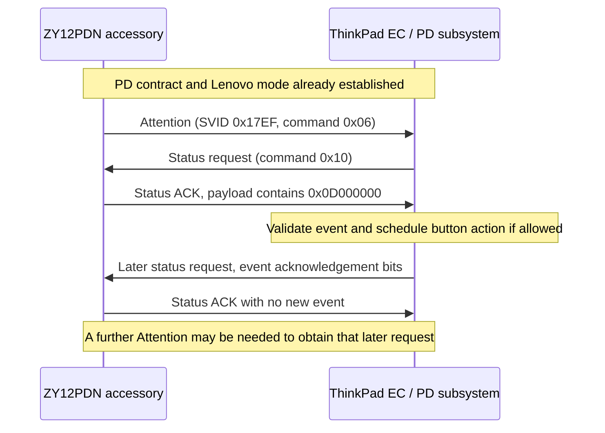

# Lenovo dock-button protocol notes

These notes describe the [current accessory source](../src/main.cpp) and
observations from static analysis of the development board's EC firmware.
They are not an official Lenovo specification or a promise about other EC
versions. No proprietary firmware images or disassembly are distributed.

## Transport and mode entry

The ZY12PDN is a USB-PD 2.0 sink/UFP. It asks for 5 V at 100 mA and uses the
FUSB302B to send SOP packets over the connected CC wire. It is not a USB HID
keyboard and does not send an ordinary USB data-endpoint command.

The laptop initiates discovery. The accessory answers:

| Request | Accessory response |
| --- | --- |
| Discover Identity, SVID `0xFF00` | Modal peripheral, VID `0x17EF`, experimental PID `0xFFFE`, certification XID zero |
| Discover SVIDs, SVID `0xFF00` | Lenovo SVID `0x17EF` |
| Discover Modes, SVID `0x17EF` | One mode VDO containing `1` |
| Enter Mode, SVID `0x17EF`, position 1 | Structured VDM ACK |
| Lenovo status, command `0x10` | Structured VDM ACK with status/event payload |

The identifiers reproduce the accessory identity used during development;
they do not represent a product assignment or certification. `main()` waits
for Accept, PS_RDY, Enter Mode and the first status request before trying the
automatic events. Other messages are still serviced through `poll()` while
it waits.

The hardware mapping comes from the upstream
[ZY12PDN analysis](https://github.com/manuelbl/zy12pdn-oss/wiki/Hardware-analysis).
PA10 drives SCL, PA9 drives SDA, and the FUSB302B's 7-bit I2C address is
`0x22`. Those board traces are opposite the MCU's hardware-I2C assignment,
so the application bit-bangs I2C. SCL is push-pull because this board lacks
its pull-up. The [FUSB302B data sheet](https://www.onsemi.com/pdf/datasheet/fusb302b-d.pdf)
documents the register/FIFO interface.

## A button event is a status reply

Attention (`0x06`) requests an exchange; it does not carry the button event.
The EC asks for Lenovo status (`0x10`), and the accessory puts event bits in
the first payload word of its ACK. A later EC status request carries the
event acknowledgement. That request must also receive a status reply.

GoodCRC traffic is omitted from the diagram. The EC can request status
without Attention when its own state changes; inspection did not establish
a guaranteed periodic status poll. The accessory therefore also uses
Attention when an event or its acknowledgement remains outstanding.

The implementation echoes the request's lower 24 status bits in its first
reply payload word, adds the pending event mask, and sends a zero second
payload word. After sending, it clears the pending event and tracks the
requested action acknowledgements separately.

## Event masks

These hexadecimal values belong in the **first status payload word**, not
in the PD header, VDM command field, or an Attention payload. Bit numbers
are zero-based.

| Bit | Event mask | Meaning observed in the EC |
| --- | --- | --- |
| 24 | `0x01000000` | Enables processing of this event group |
| 25 | `0x02000000` | Dock Wake-on-LAN event, subject to configuration/runtime policy |
| 26 | `0x04000000` | Press event, subject to the EC's press gate |
| 27 | `0x08000000` | Release event |

Useful complete masks include the group bit:

| Value | Meaning |
| --- | --- |
| `0x00000000` | No new event; does not release an existing press |
| `0x01000000` | Event group with no action; not a general "ready" or "unlock" command |
| `0x03000000` | Dock-WoL event; does not enable the BIOS setting |
| `0x05000000` | Press |
| `0x09000000` | Release |
| `0x0D000000` | Combined press/release request |

In the inspected EC, the combined request first releases the dock button.
If the press gate permits it, the EC schedules its own press, delay and
release. A separate accessory release packet is unnecessary for that pulse.
The delay is 100 EC timer ticks; its physical duration was not established,
so this is not described as a 100 ms or 200 ms pulse.

The current firmware uses `0x0D000000` both automatically and for the
physical button. It does not issue the dock-WoL event.

## Three different acknowledgements

1. **PD GoodCRC:** the peer received a PD packet. `send()` waits for the
   FUSB302's transmit-success indication. This is not button acceptance.
2. **Structured VDM ACK:** the response to a vendor request. For the button
   exchange, this is the accessory answering the EC's status request.
3. **Event acknowledgement:** bits in a subsequent status request from the
   EC, indicating processing of particular event bits.

The EC's event acknowledgement occupies bits **16 through 19**, eight bits
below the outgoing event group:

| Field | Outgoing event bit | Incoming acknowledgement bit |
| --- | --- | --- |
| Group | `0x01000000` | `0x00010000` |
| Dock WoL | `0x02000000` | `0x00020000` |
| Press | `0x04000000` | `0x00040000` |
| Release | `0x08000000` | `0x00080000` |

For example, `0x000D0000` covers group, press and release; `0x00090000`
covers group and release only. Receiving the latter does not establish that
the press was accepted. The group bit alone does not acknowledge every
action in the group.

The implementation tracks only requested action bits (`0x0E000000`) and
clears them using incoming acknowledgement bits shifted left by eight. It
keeps processing status messages before declaring an acknowledgement
missing. There is no event sequence number here: an absent bit is not a
standalone rejection code, and an old status word is not proof about a new
request.

Even a complete event acknowledgement is not proof that the laptop booted.
For the combined event, acknowledgement can precede the scheduled pulse.
The dock-WoL bit can be acknowledged before checking whether wake is enabled
or allowed in the current power state.

## Timing and scope

The EC consumes a status reply in the context of a pending exchange. In the
inspected path, Attention also clears an old pending-status flag. Sending
another Attention too early can therefore interfere with an outstanding
reply; flooding events is not a stronger power-button request. The current
polling/wait sequence is experimental. The precise cause of every observed
cold-start failure has not been established by a wire capture.

The two laptop USB-C ports have separate PD-operation queues, while some
EC workers and downstream button/power policy are shared. A normal charger
on the other port is not another source of Lenovo button messages.

Lenovo commands `0x12` and `0x13` lead to other EC power-policy handlers.
Their full protocol is outside this implementation; unsupported structured
VDM requests receive NAK. No requirement to implement those commands for
the demonstrated button action was identified.

This is a deliberately small, blocking implementation, not a complete
USB-PD policy engine. It handles Soft Reset by resetting message counters
and sending Accept, but does not implement comprehensive hard-reset or
detach/reconnect recovery. The waits and LED stops are visible directly in
`main()`, `try_send()`, `poll()` and `send()`.
